# CourtBook

**Real-time futsal court booking platform for Kathmandu.** Players discover
courts and book slots with live availability; owners manage venues, schedules,
pricing and walk-ins; admins approve owners and oversee the platform.

> Solo-built full-stack TypeScript monorepo — spec-driven, test-first, MVP
> feature-complete (M0–M8). Full design spec: [docs/blueprint.md](docs/blueprint.md) ·
> build log: [docs/PROGRESS.md](docs/PROGRESS.md).

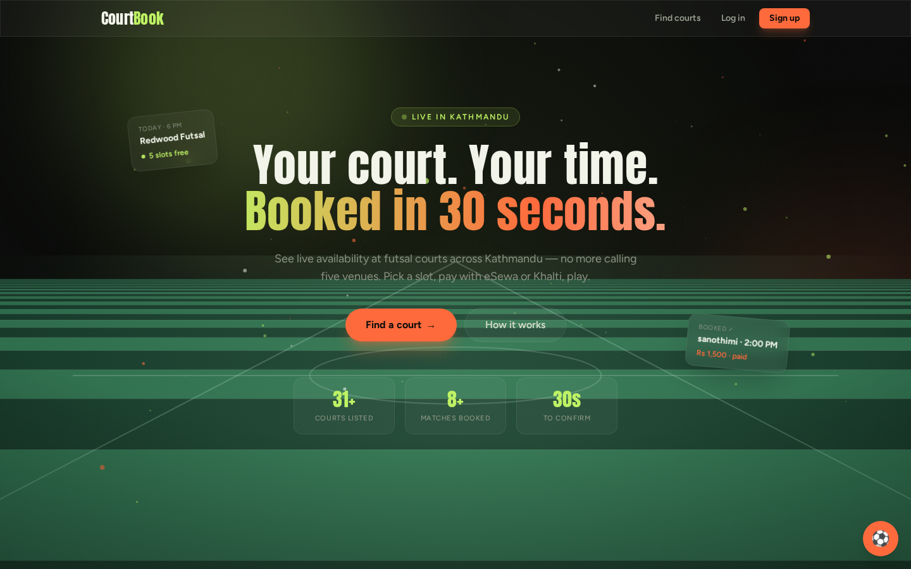

---

## What it does

Three roles, one codebase:

| Role | Capabilities |
| --- | --- |
| **Player** | Search courts by area/price/time, see live availability, book with a 10-min hold, pay (eSewa / Khalti / pay-at-venue), manage bookings, cancel with tiered refunds, export `.ics`. |
| **Owner** | Self-signup → admin approval, venue/court onboarding with schedules & pricing, day/week calendar, walk-ins, time blocks, revenue reports with CSV export. |
| **Admin** | Approve/reject owner requests, manage venues, platform totals, full audit log. Created only by another admin. |

## Engineering worth a look

These are the parts I'd walk an interviewer through:

- **Atomic booking under concurrency** — no double-bookings, guaranteed by a
  MongoDB **unique partial index** (`courtId + date + startMin` over active
  statuses), not application-level locking. Expired holds fall out of the
  partial filter, so slots reopen with zero extra code.
  Verified by a **k6 race gate: 100 virtual users → exactly 1×`201`, 99×`409`**.
  See [booking.model.ts](server/src/modules/bookings/booking.model.ts).
- **Strict layering** — `route → controller → service → model`. Controllers
  never touch models; every input is validated at the route boundary with
  **shared Zod schemas** (the same `shared/` package types the client imports),
  so client and server can never disagree on a contract.
- **Derived availability** — slots aren't stored; they're computed from court
  schedules minus active bookings and owner blocks, in **minutes-from-midnight
  (Asia/Kathmandu, UTC+5:45)** to sidestep timezone/DST bugs.
- **Secure auth** — rotating refresh sessions with **reuse detection**, lockout,
  bcrypt, email verification, password reset via a notification outbox.
- **Idempotent payments** — signature-verified eSewa/Khalti callbacks that
  re-derive the amount server-side and dedupe on an idempotency key.
- **One error contract** — `AppError(code, status, message)` → single global
  middleware → consistent `{ error: { code, message } }` envelope, PII redacted
  in logs.

## Architecture

```
client/  React 18 + TS + Vite + Tailwind + TanStack Query + Zustand + RHF/Zod
  │  (SPA, proxies /api)
  ▼
server/  Node 20 + Express 5 + Mongoose
  route → controller → service → model     ← strict layers
  helmet · cors · request-id · pino · rate-limit · zod-validate
  jobs: expiry-sweeper (node-cron)          notifications: outbox
  ▼
shared/  Zod schemas + types + NPT time utils  (imported by BOTH sides)
  ▼
MongoDB Atlas   ·   Cloudinary (signed uploads)   ·   eSewa/Khalti (sandbox)
```

Server modules: `auth · venues · courts · bookings · payments · owner · admin ·
reviews · home · assistant`. Each is a self-contained folder
(`*.routes / *.controller / *.service / *.model / *.test`).

## Quality

- **Vitest + Supertest + mongodb-memory-server** — 99 tests, every module covered.
- **Playwright** E2E and **k6** load/race tests.
- **CI (GitHub Actions)**: lint → typecheck → test → build + `npm audit` + gitleaks on every PR.
- ESLint 9 + Prettier, `no-explicit-any: error`, strict TS across the monorepo.

## Getting started

```bash
npm install                 # all workspaces
docker compose up -d        # local MongoDB + MailHog (mail UI :8025)
cp .env.example server/.env # adjust if needed
npm run dev:server          # API  → http://localhost:3000
npm run dev:client          # SPA  → http://localhost:5173

npm run seed                # demo data + first admin
                            # demo-admin@courtbook.local / demo-password-1
```

Health check: `GET http://localhost:3000/api/v1/health`

## Scripts

| Script | Does |
| --- | --- |
| `npm run dev:server` / `dev:client` | Run API / SPA in watch mode |
| `npm run lint` | ESLint + Prettier across the monorepo |
| `npm run typecheck` | `tsc` in every workspace |
| `npm test` | Vitest suites |
| `npm run build` | Builds shared → server → client |
| `npm run seed` / `seed:real` / `seed:media` | Demo data seeders |
| `npm run e2e` | Playwright end-to-end |

## Screenshots

A tour across all three roles (times in Nepal Time, seeded demo data).

**Player**

| Landing | Find a court | Venue detail |
| --- | --- | --- |
| [](docs/screenshots/02-landing-full.png) | [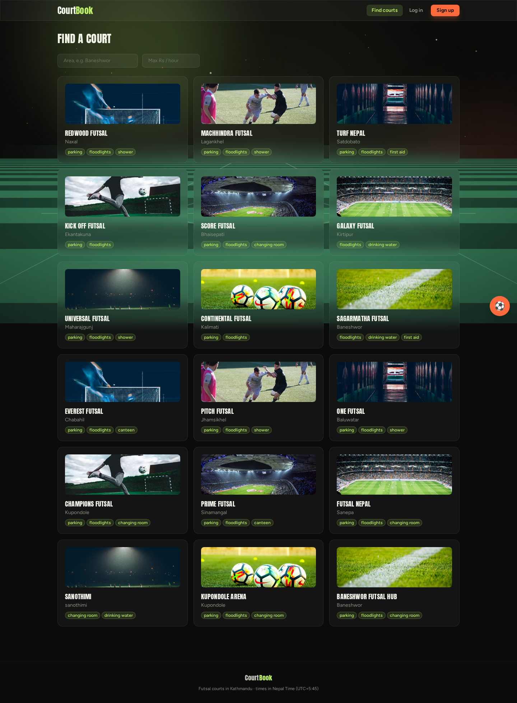](docs/screenshots/03-venues.png) | [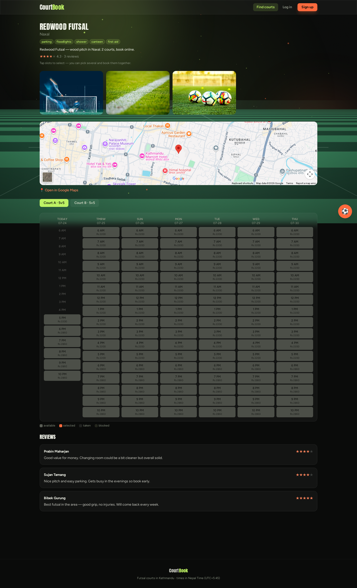](docs/screenshots/04-venue-detail.png) |

| Log in | Register | My bookings |
| --- | --- | --- |
| [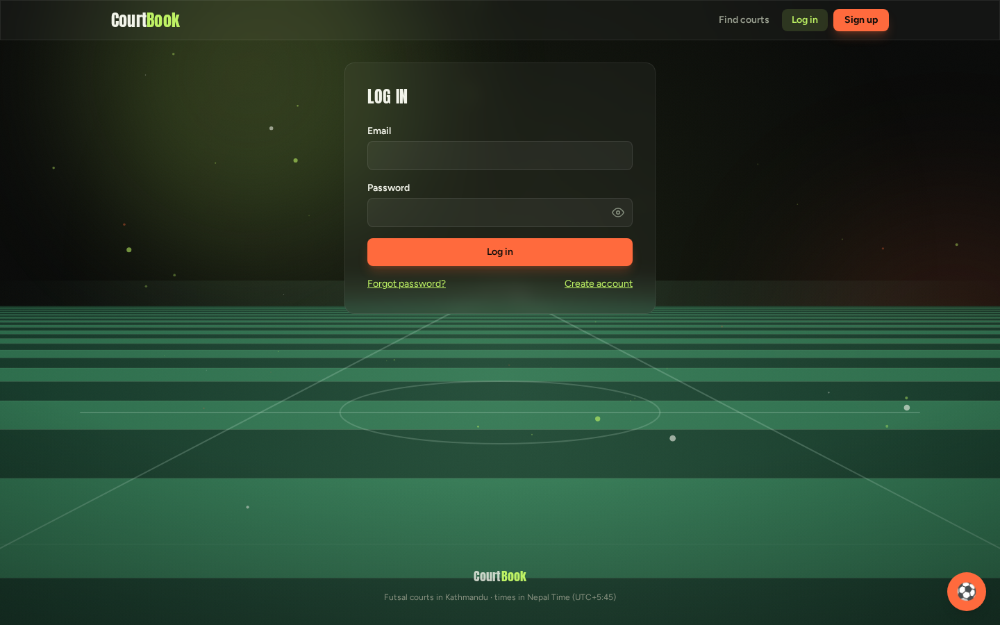](docs/screenshots/05-login.png) | [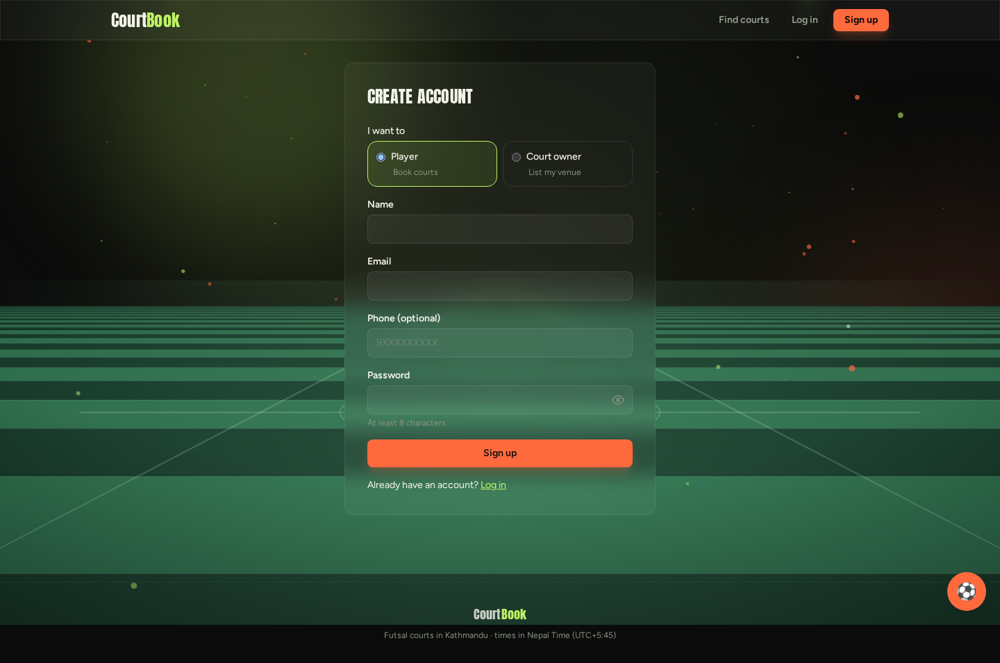](docs/screenshots/06-register.png) | [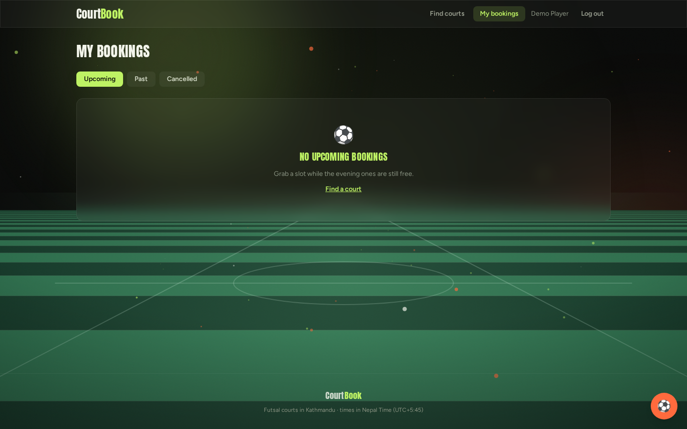](docs/screenshots/07-player-bookings.png) |

**Owner**

| Dashboard | Calendar | Reports | My venues |
| --- | --- | --- | --- |
| [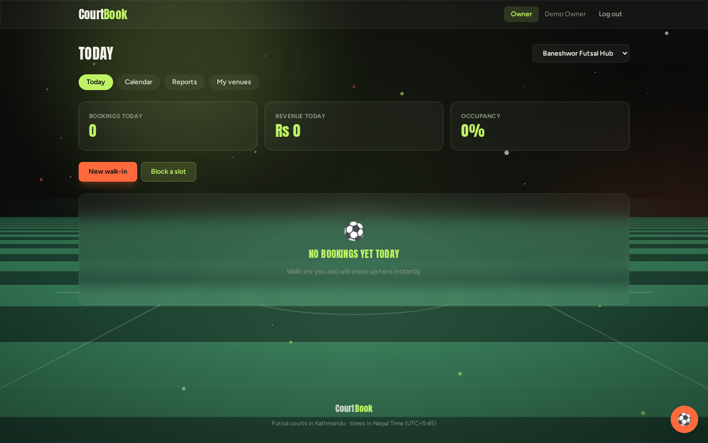](docs/screenshots/08-owner-dashboard.png) | [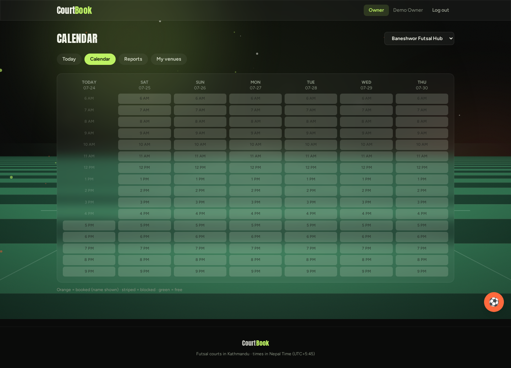](docs/screenshots/09-owner-calendar.png) | [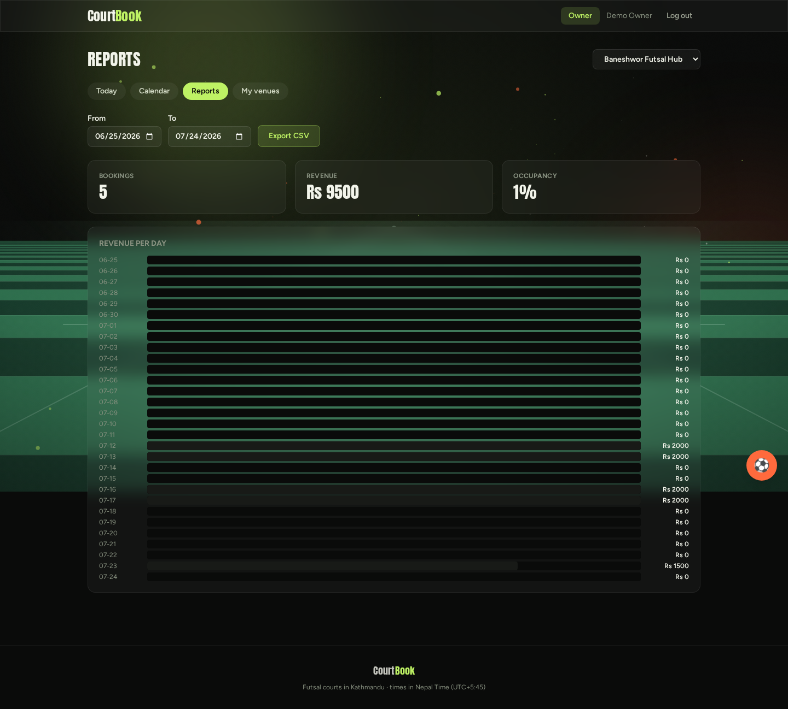](docs/screenshots/10-owner-reports.png) | [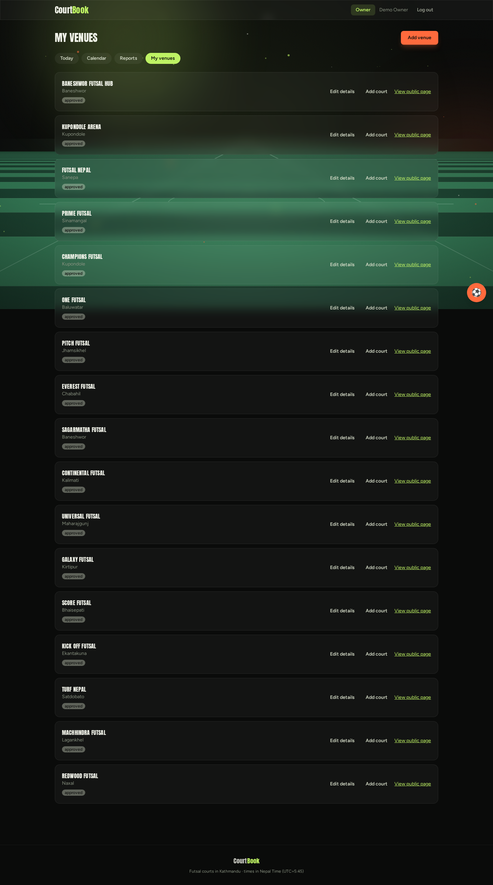](docs/screenshots/11-owner-venues.png) |

**Admin**

[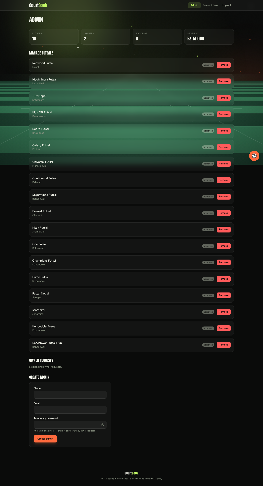](docs/screenshots/12-admin.png)

## Status

MVP feature-complete (**M0–M8**): foundations, auth, venues & courts, booking
engine, payments, player frontend, owner dashboard, AI assistant (built,
gated behind `LLM_API_KEY`), hardening & launch. Remaining: production deploy
(needs a hosting account) and the Phase 13 roadmap.

Deploy config: [render.yaml](render.yaml).
