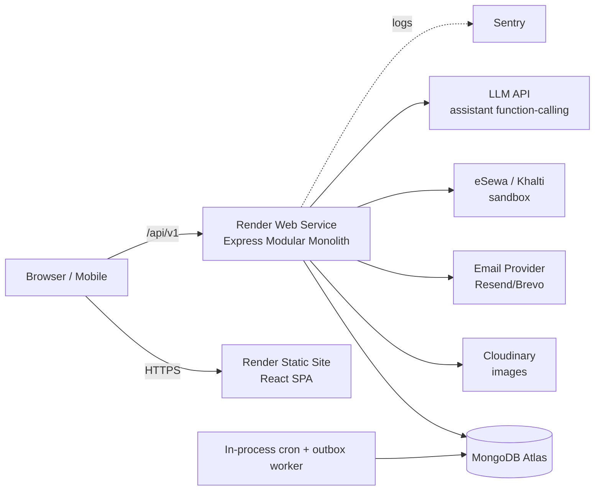
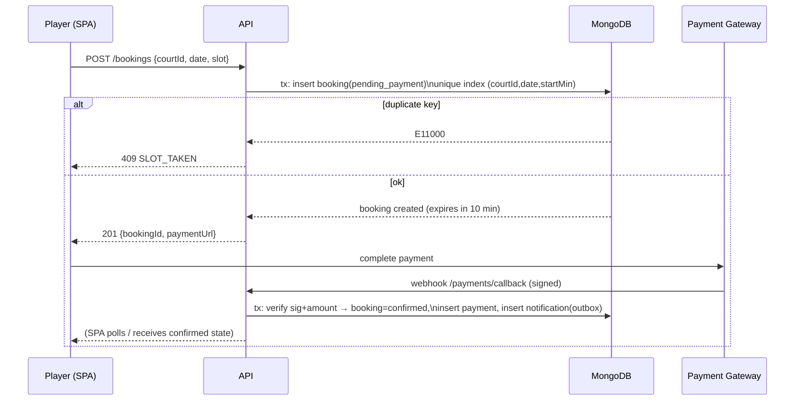
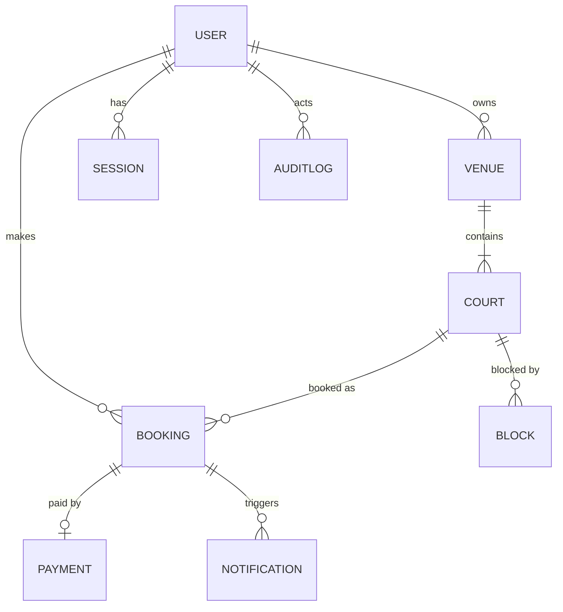
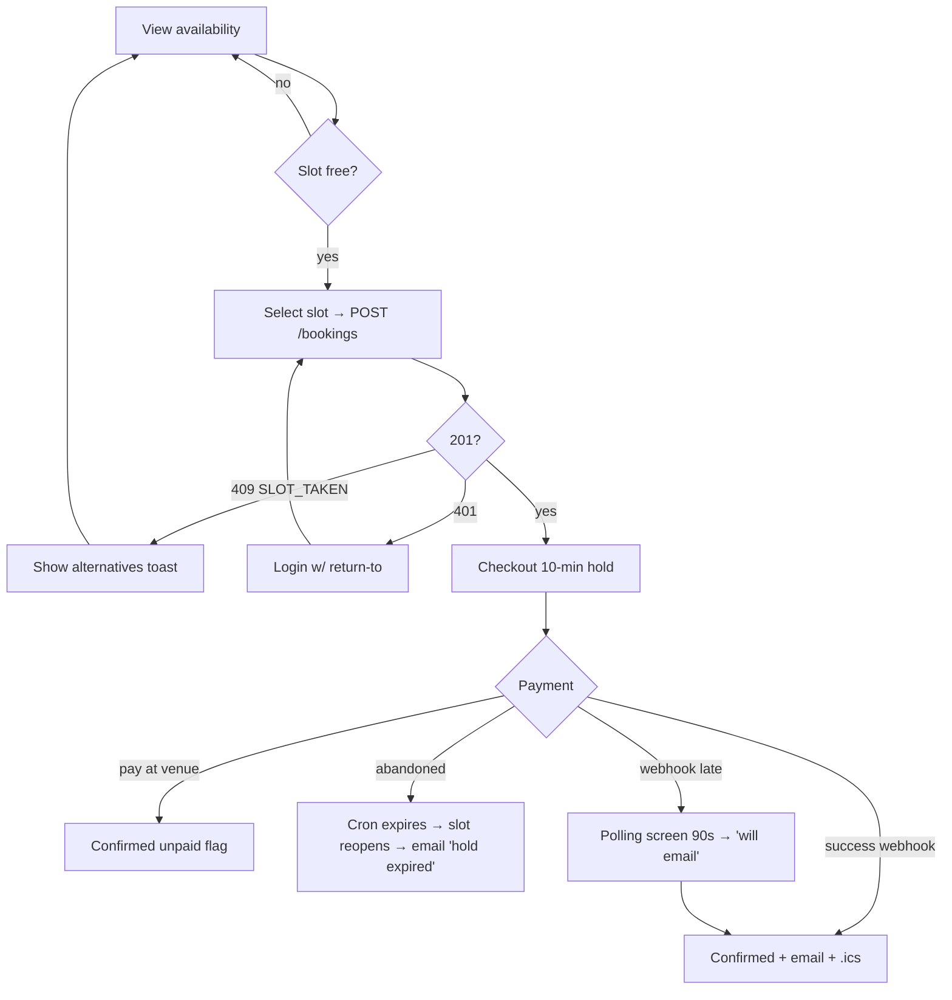

# CourtBook — Futsal Court Booking Platform
## Complete Technical Design & Architecture Blueprint

**Version:** 1.0 · **Author:** Niyesh · **Status:** Pre-development design document
**Stack:** React + TypeScript · Node.js/Express · MongoDB Atlas · Render

> **Scoping declaration (read first):** This document designs the system to be *production-ready and correct* from day one, with an explicit, documented path to scale. Where a "millions of users" architecture (microservices, Kubernetes, multi-region) conflicts with a solo-developer MVP, the pragmatic option is chosen and the trade-off is logged in the Decision Log (§2.9). Nothing is left "to be decided later" — deferred items are explicitly listed in Phase 13 with complexity estimates.

---

# PHASE 1 — PRODUCT DISCOVERY

## 1.1 Project Goal
A web platform where futsal players in Kathmandu can discover courts, check real-time slot availability, and book online — and where court owners manage courts, pricing, schedules, and bookings from an admin dashboard. Secondary goal: serve as a flagship freelance portfolio piece demonstrating full-stack + AI-integration capability.

## 1.2 Target Audience
| Segment | Description | Primary device |
|---|---|---|
| Players (organizers) | 16–35, organize weekly games, currently book by phone call | Mobile (≈85%) |
| Casual players | Join games, check availability | Mobile |
| Court owners | Small business operators, 1–4 courts, low tech comfort | Mobile + desktop |
| Court staff | Front-desk, mark walk-in bookings | Desktop/tablet |

## 1.3 Primary Use Cases
1. Player searches courts by location/time → views availability grid → books a slot → receives confirmation.
2. Owner blocks slots for maintenance / walk-ins.
3. Owner views today's schedule and revenue.
4. Player cancels within policy → slot reopens automatically.
5. Player asks the AI assistant "any court free near Baneshwor Saturday 7pm?" → gets structured answers with booking links.

## 1.4 Secondary Use Cases
- Recurring weekly booking ("every Sunday 6–7pm").
- Booking reminders (email; SMS later).
- Owner exports monthly booking report (CSV).
- Guest checkout (book with phone + OTP later; MVP requires account).

## 1.5 User Pain Points (current state)
| Pain | Who | How we solve it |
|---|---|---|
| Must call each venue to check availability | Player | Live availability grid |
| Double bookings from paper registers | Owner | Atomic booking engine (§7.3) |
| No-shows with no deposit | Owner | Online prepayment / deposit |
| No visibility into utilization | Owner | Dashboard analytics |
| Slots forgotten / disputes | Both | Email confirmations + audit trail |

## 1.6 Competitor Analysis
| Competitor | Model | Strengths | Weaknesses we exploit |
|---|---|---|---|
| Phone/Facebook booking (status quo) | Manual | Zero friction for owners | No availability visibility, double-booking |
| Generic booking SaaS (e.g., Calendly-style) | Horizontal | Mature | Not sport-specific, no local payments, English-only pricing UX |
| Local futsal apps (research current NP market before launch) | Vertical | Local payments | Typically poor UX, no AI assistant, weak admin tooling |

**Feature comparison target:** match the status quo on simplicity, beat it on availability transparency; match local apps on eSewa/Khalti, beat them on admin dashboard + AI assistant.

## 1.7 Functional Requirements (MVP)
- FR-1: Email/password auth with email verification and password reset.
- FR-2: Role-based access — `player`, `owner`, `admin`.
- FR-3: Venue & court CRUD (owner) with photos, location, amenities, pricing.
- FR-4: Slot availability engine: configurable open hours, slot length (default 60 min), per-slot pricing overrides.
- FR-5: Booking creation with atomic conflict prevention (no double booking, ever).
- FR-6: Booking lifecycle: `pending_payment → confirmed → completed | cancelled | no_show`.
- FR-7: Payments: eSewa + Khalti (sandbox in demo), pay-at-venue option flag per venue.
- FR-8: Email notifications: confirmation, cancellation, reminder (T-2h).
- FR-9: Owner dashboard: today view, calendar view, revenue summary, manual/walk-in booking, slot blocking.
- FR-10: AI assistant: natural-language availability queries + guided booking (function-calling into the availability API).
- FR-11: Platform admin: user management, venue approval, audit log.

## 1.8 Non-Functional Requirements
| Category | Requirement |
|---|---|
| Performance | Availability query p95 < 300 ms; page LCP < 2.5 s on 3G |
| Availability | 99.5% (Render free/starter tier realistic target) |
| Security | OWASP Top 10 mitigations (§Phase 8); bcrypt cost 12; JWT 15 min + rotating refresh |
| Scalability | Stateless API — horizontal scaling by adding instances; no server-side sessions |
| Data integrity | Zero double bookings under concurrent load (proven by load test §11.5) |
| Accessibility | WCAG 2.1 AA on booking flow |
| Localization-ready | All UI strings in a dictionary; NPR currency; Asia/Kathmandu timezone handled explicitly (UTC+5:45 — a classic bug source) |

## 1.9 Business Requirements
- Free for players; monetization path = commission per booking or owner subscription (post-MVP, §Phase 13).
- Venue onboarding must take an owner < 15 minutes.
- Demo mode with seeded data for portfolio viewers (read-only admin demo account).

## 1.10 Success Metrics & KPIs
| KPI | Target (3 months post-launch) |
|---|---|
| Booking conversion (availability view → confirmed) | > 25% |
| Double-booking incidents | 0 |
| Owner weekly active usage | > 60% of onboarded venues |
| Booking API error rate | < 0.5% |
| AI assistant successful task completion | > 70% of assistant sessions |

## 1.11 Future Roadmap (summary — detail in Phase 13)
Recurring bookings → team/match-making features → SMS notifications → mobile PWA install → owner subscriptions → multi-sport (basketball, badminton).

---

# PHASE 2 — SYSTEM ARCHITECTURE

## 2.1 Overall Architecture
**Chosen: Modular monolith (single Express app, feature-module folder structure) + React SPA + MongoDB Atlas.**

### Monolith vs Microservices — decision analysis
| Criterion | Modular monolith | Microservices |
|---|---|---|
| Solo-dev velocity | ✅ High | ❌ Very low |
| Operational cost (Render) | ✅ 1 service | ❌ N services + service mesh |
| Booking transaction integrity | ✅ Single DB, easy atomicity | ❌ Distributed transactions/sagas |
| Scale ceiling | Fine to ~10⁵ DAU with caching | Higher, but irrelevant now |
| Migration path | Extract modules later (notification worker first) | — |

**Decision:** modular monolith. Module boundaries (`auth`, `venues`, `bookings`, `payments`, `notifications`, `assistant`, `admin`) are enforced in folder structure and import rules so future extraction is mechanical, not a rewrite.

## 2.2 Client Architecture
- React 18 + TypeScript + Vite. SPA (not Next.js) — decision log D-3.
- State: **TanStack Query** for server state (caching, refetch, optimistic updates) + **Zustand** for the small amount of client state (auth session, UI). Redux rejected as overweight for this scope.
- Routing: React Router v6, route-based code splitting (`React.lazy`).
- Forms: React Hook Form + Zod schemas **shared with the backend** via a `/shared` package — single source of validation truth.
- Styling: Tailwind CSS + small component library (§3.20).

## 2.3 Backend Architecture
```
src/
  modules/
    auth/        (routes, controller, service, model, schemas)
    users/
    venues/
    courts/
    bookings/    ← core domain
    payments/
    notifications/
    assistant/
    admin/
  core/          (config, db, logger, errors, middleware)
  jobs/          (cron: reminders, expiry sweeper)
  shared/        (zod schemas shared w/ frontend)
```
Layering per module: `route → controller (HTTP concerns) → service (business logic) → model (Mongoose)`. Controllers never touch models directly; services never read `req/res`.

## 2.4 Database Architecture
MongoDB Atlas M0 (dev) / M10 (prod path). Justification vs MySQL (also in Niyesh's stack): booking documents are naturally denormalized, Atlas gives managed backups + free tier, and MongoDB **unique compound indexes + transactions** give us the atomicity the booking engine needs (§7.3). Trade-off logged: relational reporting queries are harder; mitigated with aggregation pipelines and a future read-model if needed.

## 2.5 Caching Layer
MVP: in-process cache (`node-cache`) for venue lists & static config, TTL 60 s. Availability data is **never cached** (correctness > speed; queries are indexed and fast). Scale path: Redis (Upstash free tier) for cache + rate-limit counters when moving past one instance — logged D-6.

## 2.6 Storage Layer
Venue photos → Cloudinary free tier (signed direct uploads from client; backend issues signature; never proxy file bytes through the API). Limits: 5 images/venue, ≤ 5 MB, MIME whitelist enforced server-side via Cloudinary upload presets.

## 2.7 AuthN / AuthZ Architecture
- **Authentication:** short-lived JWT access token (15 min, in memory on client) + rotating refresh token (7 days, `httpOnly` `Secure` `SameSite=Lax` cookie, stored hashed in DB, one-time-use rotation with reuse detection → session family revocation).
- **Authorization:** role claim in JWT (`player|owner|admin`) + **resource ownership checks in services** (owner can only mutate venues where `venue.ownerId === user.id`). Role check alone is never sufficient — every mutating service call re-verifies ownership (defense against IDOR).

## 2.8 API Architecture
REST, versioned at `/api/v1`. JSON only. Standard envelope:
```json
{ "success": true, "data": { }, "meta": { "page": 1 } }
{ "success": false, "error": { "code": "SLOT_TAKEN", "message": "…", "details": [] } }
```
Error codes are machine-readable enums (frontend maps them to friendly copy). Pagination: cursor-based for bookings (stable under inserts), offset for small admin lists.

## 2.9 Decision Log
| # | Decision | Alternatives | Reason |
|---|---|---|---|
| D-1 | Modular monolith | Microservices | Solo dev, transactional booking domain, cost |
| D-2 | MongoDB Atlas | MySQL | Managed, free tier, unique-index booking lock, portfolio stack match |
| D-3 | Vite SPA | Next.js | Public pages need SEO → mitigated with prerendered landing + venue meta via `react-helmet` + future SSR path; SPA keeps deploy simple on Render static site |
| D-4 | JWT + rotating refresh cookie | Server sessions | Stateless API scales horizontally; refresh rotation covers revocation |
| D-5 | TanStack Query | Redux Toolkit | Server-state heavy app; less boilerplate |
| D-6 | In-process cache MVP | Redis now | One instance now; Redis added at 2+ instances |
| D-7 | Slot = derived, Booking = stored | Pre-generated slot rows | No slot-row explosion; availability computed from schedule minus bookings/blocks |
| D-8 | eSewa/Khalti sandbox + pay-at-venue | Stripe only | Local realism; Stripe test mode kept for international demo |

## 2.10 Event-Driven Elements, Queues, Cron
- MVP has **no external queue** (cost). Async work (emails) uses an **outbox pattern**: services write a `notifications` document in the same transaction as the booking; a worker loop (in-process, 10 s poll) sends and marks them. This survives crashes (at-least-once delivery, idempotency key = notification `_id`).
- Cron jobs (node-cron, single instance guarded by a DB lock document):
  - `*/5 min` — expire `pending_payment` bookings older than 10 min (frees slots).
  - `hourly` — queue T-2h booking reminders.
  - `daily 02:00 NPT` — mark past `confirmed` bookings `completed`; aggregate daily revenue stats.
- Scale path: replace outbox worker with BullMQ + Redis (module boundary already isolates it).

## 2.11 Notification System
Channels: email (MVP, via Resend or Brevo free tier), in-app toast/badge (MVP), SMS (Phase 13; Sparrow SMS for Nepal). Every notification: template id, payload, status (`queued|sent|failed`), retry count (max 3, exponential backoff), idempotency key.

## 2.12 Logging, Monitoring, Analytics
- **Logging:** pino (JSON), request-id middleware (uuid v4 per request, propagated into all log lines), levels: `error/warn/info` in prod. No PII in logs (emails masked `n***@gmail.com`).
- **Monitoring:** Render health checks on `/api/v1/health` (checks DB ping); UptimeRobot free external ping; Sentry free tier for FE+BE error tracking.
- **Analytics:** lightweight self-owned events collection (`analytics_events`: name, userId?, props, ts) + Plausible/Umami script on frontend. Key events listed per page in Phase 3.

## 2.13 Scalability Plan
1. Now: 1 Render web service + Atlas M0. Stateless API.
2. 10× : Render autoscale to 2–3 instances, add Redis (cache + rate limits + BullMQ), Atlas M10, CDN for static (Render CDN default).
3. 100× : extract `notifications` worker service, add read replicas / Atlas search for venue discovery, move availability hot path behind Redis with event invalidation.

## 2.14 Disaster Recovery & Backup
- Atlas: continuous backups (M10) / daily snapshot mirror to a second cluster via scheduled `mongodump` GitHub Action (M0). RPO 24 h (MVP), RTO < 2 h (redeploy from repo + restore dump — runbook in `/docs/runbooks/restore.md`).
- All infra config as code: `render.yaml` blueprint in repo; env vars documented in `.env.example`.

## 2.15 Infrastructure Diagram


## 2.16 Core Sequence Diagram — Booking with Payment


---

# PHASE 3 — FRONTEND PLANNING

## 3.0 Global Conventions (apply to every page)
- **Responsive:** mobile-first; breakpoints `sm 640 / md 768 / lg 1024`. Booking grid switches from horizontal day-scroller (mobile) to week matrix (desktop).
- **Loading:** every data region has a skeleton component (`<SkeletonCard/>`, `<SkeletonGrid/>`); no full-page spinners.
- **Empty states:** illustration + one-line explanation + primary CTA.
- **Error states:** inline retry card with error code; global toast for mutations; offline banner via `navigator.onLine` listener.
- **Accessibility:** semantic landmarks, focus trap in modals, visible focus rings, labels on all inputs, slot grid navigable by arrow keys, color contrast ≥ 4.5:1, `aria-live="polite"` for availability refreshes.
- **Toasts:** success (green, 4 s), error (red, sticky until dismiss for payment errors).
- **Analytics:** every page fires `page_view {route}`; key funnel events listed per page.
- **Timezone:** all dates displayed in Asia/Kathmandu regardless of device TZ; utility `formatNPT()` used everywhere (bug class eliminated by convention).

## 3.1 Page Inventory & Routes
| # | Page | Route | Access |
|---|---|---|---|
| 1 | Landing | `/` | Public |
| 2 | Venue search/list | `/venues` | Public |
| 3 | Venue detail + availability | `/venues/:slug` | Public (booking requires auth) |
| 4 | Booking checkout | `/book/:bookingId` | Player |
| 5 | Booking confirmation | `/bookings/:id/confirmed` | Player |
| 6 | My bookings | `/me/bookings` | Player |
| 7 | Profile & settings | `/me/settings` | Auth |
| 8 | Login / Register / Forgot / Reset / Verify | `/auth/*` | Public |
| 9 | Owner dashboard (today) | `/owner` | Owner |
| 10 | Owner calendar | `/owner/calendar` | Owner |
| 11 | Owner venue management | `/owner/venues`, `/owner/venues/:id/edit` | Owner |
| 12 | Owner reports | `/owner/reports` | Owner |
| 13 | Platform admin | `/admin/*` | Admin |
| 14 | AI assistant | floating widget on all public/player pages | Public (booking via it requires auth) |
| 15 | 404 / error boundary pages | `*` | Public |

## 3.2 Page Spec — Venue Detail + Availability (the money page)
- **Purpose:** convert a visitor into a booking. **Target user:** player.
- **Route:** `/venues/:slug` (slug for SEO; canonical + OG meta via helmet).
- **Layout:** photo gallery → name, rating placeholder, location w/ map link, amenities chips → pricing summary → **availability grid** → sticky "Book selected slot" CTA (mobile bottom bar).
- **Availability grid wireframe:** columns = next 7 days (horizontal scroll on mobile), rows = time slots from venue open→close. Cell states: `available` (price shown), `taken` (grey, disabled), `blocked` (striped), `past` (faded), `selected` (accent ring). Legend below grid.
- **Component tree:**
```
<VenuePage>
 ├─ <Gallery images/>
 ├─ <VenueHeader name location amenities/>
 ├─ <AvailabilityGrid days slots onSelect/>   ← reusable, also used in owner calendar (readOnly variant)
 │   └─ <SlotCell state price onClick aria-label/>
 ├─ <BookingBar selection onBook/>            ← sticky
 └─ <AssistantWidget context={venueId}/>
```
- **State/API:** `useQuery(['availability', venueId, weekStart])`, refetch on window focus + 60 s interval; optimistic slot lock on select is **not** done (server is the only truth); selection is client-only until POST.
- **Edge cases:** slot becomes taken between render and click → POST returns 409 → cell flips to taken + toast "Just missed it — that slot was taken. Here are nearby free slots" (shows same-day alternatives). Venue closed date (holiday block) → whole column shows "Closed". Unverified user clicks Book → redirect to login with `?next=` return URL preserving selection in sessionStorage.
- **Possible user mistakes:** double-tap book (button disables on first click, idempotency key sent); selecting past slot (disabled + not focusable).
- **Analytics:** `venue_view`, `slot_select`, `booking_start`, `booking_conflict`.

## 3.3 Page Spec — Booking Checkout `/book/:bookingId`
- Shows 10-minute **countdown timer** (server-issued `expiresAt`; client renders remaining, never trusts local math for enforcement). Payment method radio: eSewa / Khalti / Pay at venue (if venue allows). On expiry → state `expired` screen with "slot released" message + rebook CTA.
- Error states: gateway redirect fail (retry), webhook delay (polling screen "Confirming payment…" up to 90 s → then "We'll email you when confirmed" + support link).
- Validation: none user-typed here except optional note (≤ 200 chars, sanitized).

## 3.4 Page Spec — Owner Dashboard `/owner`
- **Today at a glance:** timeline of today's bookings per court (color by status), occupancy %, today's revenue, quick actions: *Add walk-in booking*, *Block slot*.
- Walk-in modal: pick court/slot → name + phone (optional) → creates `confirmed` booking with `channel: walk_in`, bypasses payment. Uses the same atomic engine — walk-ins can also lose a race, same 409 handling.
- Empty state (new owner): setup checklist wizard (add venue → add court → set schedule → publish).
- Keyboard: `N` new walk-in, `B` block slot, arrows navigate timeline (documented in a `?` shortcuts modal).

## 3.5 Remaining pages — abbreviated specs
- **Search `/venues`:** filters (area, date+time "free at", price range, amenities), sort (distance requires geolocation permission — graceful fallback to alphabetical), URL-synced filter state (shareable links), skeleton cards ×6, empty state suggests widening filters. Debounced (300 ms) filter → single query.
- **My bookings `/me/bookings`:** tabs Upcoming/Past/Cancelled; cancel flow with policy explanation modal (refund preview computed by API, never client); add-to-calendar (.ics download).
- **Auth pages:** zod-validated forms; register = name/email/phone/password (strength meter, min 8, zxcvbn ≥ 2); verify-email interstitial with resend (rate-limited, 60 s cooldown UI); reset via emailed one-time token (30 min).
- **Owner venue edit:** multi-step form (details → photos → courts → schedule → pricing → review); schedule editor = per-weekday open/close + slot length; unsaved-changes guard on navigation.
- **Owner reports:** date-range picker, bookings/revenue/occupancy charts (recharts), CSV export (client-side from API JSON).
- **Admin `/admin`:** user table (search, role change with confirm modal + audit log write), venue approval queue (approve/reject w/ reason), audit log viewer (filter by actor/action/date), feature flags table (simple booleans in `config` collection).

## 3.6 Reusable Component Library (specs)
| Component | Inputs (props) | States | A11y notes |
|---|---|---|---|
| `Button` | variant(primary/secondary/danger/ghost), size, loading, disabled, iconLeft | idle/hover/focus/loading/disabled | `aria-busy` when loading |
| `Input/Select/DatePicker` | label, error, hint, required | default/focus/error/disabled | label always rendered; error via `aria-describedby` |
| `Modal` | title, onClose, size | open/closing | focus trap, `Esc` close, restore focus |
| `AvailabilityGrid` | days[], slots[], mode(book/manage/readOnly), onSelect | loading/loaded/error/stale | grid role, arrow-key nav, cell `aria-label` "Sat 7 PM, Rs 1500, available" |
| `SlotCell` | state, price, selected | 6 visual states (§3.2) | disabled cells `aria-disabled` |
| `Toast` | type, message, sticky? | enter/visible/exit | `role=alert` for errors |
| `EmptyState` | icon, title, body, cta | — | — |
| `StatCard` | label, value, delta | loading/loaded | — |
| `CountdownTimer` | expiresAt, onExpire | running/expired | `aria-live=off` (updates too frequent), textual fallback |

All components: Tailwind classes only, variants via `cva`, stories documented in a simple `/dev/components` playground route (Storybook skipped for scope — logged trade-off).

## 3.7 Design Register (approved mockups — source of truth for look & feel)

Finished Claude Design exports live in the repo at `/design` (see `design/README.md`). **During frontend milestones (M5–M8), implementation must match these files. Where a mockup and a written spec in this document conflict on visuals, the mockup wins; on behavior/states/edge cases, this document wins.**

| Design | File | Blueprint spec |
|---|---|---|
| Design system sheet (tokens, buttons, inputs, badges, slot-cell states) | `design/00-system-sheet.html` | §3.6 |
| Brand panel extra (turf gradient, corner-arc treatment) | `design/00b-brand-panel.dc.html` | — |
| Landing | `design/01-landing.dc.html` | §3.5 |
| Venue search | `design/02-search.dc.html`, `design/02-search-standalone.html` | §3.5 |
| Venue detail + availability grid | `design/03-venue-detail.html` | §3.2 |
| Booking flow: checkout, hold-expired, confirmed ticket, my bookings | `design/04-06-booking-flow.dc.html` | §3.3, §3.5 |
| Auth set + settings/sessions | `design/07-08-auth-settings.dc.html` | §3.5, §6.3 |
| Owner dashboard + calendar + walk-in + block slot | `design/09-10-owner-ops.dc.html` | §3.4, §3.5 |
| Owner venue wizard (5 steps) | `design/11-venue-wizard.dc.html` | §3.5 |
| Owner reports | `design/12-reports.dc.html`, `design/screenshots/12-reports-lower.png` | §3.5 |
| Admin panel | `design/13-admin.dc.html` | Phase 12 |
| AI assistant widget | `design/14-assistant.dc.html` | §3.5, §7.7 |
| Error/empty family (404, 500, offline, session-expired) | **not yet designed** — design prompt 15 pending | §3.0 |

Format note: `*.dc.html` files are Claude Design canvas exports that require the sibling `design/support.js` to render — open them in a browser from within `/design`. Plain `*.html` files are standalone. All designs are **visual source of truth, never production code**: extract exact values (hex, spacing, radii, type sizes) from them and view the rendered result, but build production components fresh per §2.2/§3.6. Prototype markup, inline styles, and export JS must not be copied into `client/`.
---

# PHASE 4 — BACKEND PLANNING

## 4.1 Service (module) Responsibilities
| Module | Responsibilities | Depends on |
|---|---|---|
| auth | register, login, refresh rotation, verify email, reset password, session revocation | users, notifications |
| users | profile CRUD, role management (admin only) | — |
| venues | venue CRUD, publish/approve workflow, search | users |
| courts | court CRUD, schedule & pricing config | venues |
| bookings | availability computation, booking lifecycle, cancellation policy, walk-ins, blocks | courts, payments, notifications |
| payments | initiate eSewa/Khalti, verify webhooks/signatures, refund records | bookings |
| notifications | outbox worker, templates, email adapter | — |
| assistant | LLM chat endpoint, function-calling into availability/booking services, guardrails | bookings, venues |
| admin | audit log, approvals, feature flags, stats | all (read) |

Every service: input validated by shared Zod schema at the route boundary (single validation middleware `validate(schema)`), output serialized through explicit DTO mappers (never `res.json(mongooseDoc)` — prevents field leaks like `passwordHash`), errors thrown as typed `AppError(code, httpStatus, message)` caught by one global error middleware.

## 4.2 Cross-cutting middleware order
`helmet → cors(allowlist) → request-id → pino-http → rateLimiter(tiered) → cookieParser → json({limit:'100kb'}) → auth(optional) → routes → notFound → errorHandler`

## 4.3 Rate limiting tiers
| Scope | Limit | Key |
|---|---|---|
| Global API | 300 req / 15 min | IP |
| `/auth/login`, `/auth/register` | 5 / 15 min + progressive lockout (§8) | IP + email |
| `/bookings` POST | 10 / hour | userId |
| `/assistant/chat` | 20 msgs / hour | userId or IP |
| Payment webhook | signature-gated, no user RL | — |

## 4.4 API Specification (complete endpoint table)
Legend: 🔓 public · 🔑 auth · 👑 owner (of resource) · 🛡 admin. All errors use envelope §2.8.

### Auth
| Method & URL | Access | Body / Params | Success | Errors |
|---|---|---|---|---|
| POST `/auth/register` | 🔓 | {name, email, phone, password} | 201 {user} + sends verify mail | 409 EMAIL_EXISTS, 422 VALIDATION |
| POST `/auth/login` | 🔓 | {email, password} | 200 {accessToken, user} + refresh cookie | 401 INVALID_CREDENTIALS, 423 ACCOUNT_LOCKED, 403 EMAIL_UNVERIFIED |
| POST `/auth/refresh` | cookie | — | 200 {accessToken} (rotates cookie) | 401 REFRESH_INVALID (reuse → revoke family) |
| POST `/auth/logout` | 🔑 | — | 204 (revokes session) | — |
| POST `/auth/verify-email` | 🔓 | {token} | 200 | 400 TOKEN_INVALID/EXPIRED |
| POST `/auth/forgot-password` | 🔓 | {email} | 200 always (no enumeration) | — |
| POST `/auth/reset-password` | 🔓 | {token, password} | 200 (revokes all sessions) | 400 TOKEN_INVALID |

### Venues & Courts
| Method & URL | Access | Notes |
|---|---|---|
| GET `/venues` | 🔓 | query: area, date, time, priceMax, amenities[], cursor; returns published+approved only |
| GET `/venues/:slug` | 🔓 | includes courts summary |
| POST `/venues` | 🔑(owner) | creates `draft`; 422 on schema fail |
| PATCH `/venues/:id` | 👑 | ownership check; approved venues re-enter `pending_review` on material edits |
| POST `/venues/:id/publish` | 👑 | → `pending_review` |
| POST `/venues/:id/photos/sign` | 👑 | returns Cloudinary signed upload params |
| POST/PATCH/DELETE `/venues/:id/courts…` | 👑 | court + schedule + pricing config; DELETE is soft (blocked if future confirmed bookings exist → 409 HAS_FUTURE_BOOKINGS) |

### Availability & Bookings (core)
| Method & URL | Access | Notes |
|---|---|---|
| GET `/courts/:id/availability?from=YYYY-MM-DD&days=7` | 🔓 | computed: schedule − bookings − blocks; ≤ 14 days window (422 beyond) |
| POST `/bookings` | 🔑 | {courtId, date, startMin, idempotencyKey} → 201 pending_payment {expiresAt, paymentOptions} · 409 SLOT_TAKEN · 422 SLOT_INVALID (outside schedule/past/lead-time) |
| GET `/bookings/:id` | 🔑(owner-of-booking or venue owner) | |
| POST `/bookings/:id/cancel` | 🔑 | policy engine computes refund (§7.4); 409 TOO_LATE_TO_CANCEL |
| GET `/me/bookings?status=&cursor=` | 🔑 | cursor pagination |
| POST `/owner/bookings/walkin` | 👑 | same atomic path, status confirmed, channel walk_in |
| POST `/owner/blocks` | 👑 | {courtId, date, startMin, endMin, reason}; conflicts with confirmed bookings → 409 with list |
| DELETE `/owner/blocks/:id` | 👑 | |

### Payments
| Method & URL | Access | Notes |
|---|---|---|
| POST `/payments/initiate` | 🔑 | {bookingId, provider} → gateway redirect payload; 409 if booking not pending |
| POST `/payments/callback/:provider` | gateway | HMAC/signature verified; **idempotent** (provider txn id unique index); amount cross-checked vs booking price server-side |
| GET `/payments/:id` | 🔑 | status polling for checkout page |

### Assistant
| Method & URL | Access | Notes |
|---|---|---|
| POST `/assistant/chat` | 🔓/🔑 | {sessionId, message} → streamed reply; tools: `search_venues`, `check_availability`, `create_booking_draft` (auth required for the last; assistant never confirms payment) |

### Admin
| Method & URL | Access |
|---|---|
| GET `/admin/stats`, GET/PATCH `/admin/users`, GET `/admin/venues?status=pending_review`, POST `/admin/venues/:id/approve|reject`, GET `/admin/audit`, GET/PATCH `/admin/flags` | 🛡 (all actions write audit entries) |

### System
| GET `/api/v1/health` | 🔓 | {status, db, uptime, version} |

**Example — POST /bookings**
```http
POST /api/v1/bookings
Authorization: Bearer <jwt>
{ "courtId":"665f…", "date":"2026-07-11", "startMin":1140, "idempotencyKey":"c1a2…" }

201 → { "success":true, "data":{ "bookingId":"…", "status":"pending_payment",
        "price":1500, "expiresAt":"2026-07-04T14:25:00Z",
        "paymentOptions":["esewa","khalti","venue"] } }
409 → { "success":false, "error":{ "code":"SLOT_TAKEN",
        "message":"That slot was just booked.", "details":{ "alternatives":[…] } } }
```

## 4.5 Retry / transaction policy
- All multi-document writes (booking+notification, payment+booking) inside MongoDB transactions with 3-retry on transient `TransientTransactionError`.
- Outbound email: 3 retries, backoff 30 s/2 m/10 m, then `failed` + admin visibility.
- Idempotency: `POST /bookings` honors client `idempotencyKey` (unique per user, 24 h TTL collection) → repeat returns original result, prevents double-charge on network retry.

---

# PHASE 5 — DATABASE DESIGN

## 5.1 ER Diagram


## 5.2 Collections
Common audit fields on every collection: `createdAt`, `updatedAt` (mongoose timestamps), `deletedAt` (soft delete where noted). IDs are ObjectId; all foreign keys indexed.

### users
| Field | Type | Rules |
|---|---|---|
| name | string 2–60 | required |
| email | string, lowercase | unique index; email format |
| phone | string | NP format `98\d{8}` optional |
| passwordHash | string | bcrypt(12); **never serialized** |
| role | enum player/owner/admin | default player |
| emailVerifiedAt | date? | login gate |
| failedLogins, lockedUntil | int, date? | brute-force lockout |
| deletedAt | date? | soft delete |

Example: `{name:"Niyesh", email:"n@x.com", role:"owner", emailVerifiedAt:"…"}`

### sessions (refresh tokens)
`userId(idx) · tokenHash(unique) · familyId · expiresAt(TTL index) · revokedAt? · ip · userAgent` — rotation writes new doc, reuse of a revoked token revokes the whole `familyId`.

### venues
`ownerId(idx) · name · slug(unique) · description · area(idx) · geo{lat,lng}(2dsphere idx) · amenities[] · photos[{url,publicId}] · payAtVenue:bool · status enum draft|pending_review|approved|rejected(idx) · rejectionReason? · deletedAt?`

### courts
`venueId(idx) · name("Court A") · surface enum · size("5v5") · basePrice int(NPR) · slotMinutes int=60 · schedule[7]{openMin,closeMin,closed} · priceOverrides[{dayOfWeek?,startMin,endMin,price}] · active:bool`
Validation: `openMin < closeMin`, overrides within open hours, price 100–100000.

### bookings ← core
| Field | Type | Notes |
|---|---|---|
| courtId | ObjectId | indexed |
| venueId | ObjectId | denormalized for owner queries |
| userId | ObjectId? | null for walk-ins |
| date | string "YYYY-MM-DD" (NPT) | part of uniqueness |
| startMin, endMin | int (minutes from midnight NPT) | 1140 = 19:00 |
| status | enum pending_payment/confirmed/completed/cancelled/no_show/expired | indexed |
| price | int | snapshot at booking time |
| channel | enum online/walk_in | |
| customer | {name,phone}? | walk-ins |
| expiresAt | date? | for pending_payment sweep |
| cancellation | {at, by, refundPct, reason}? | |
| idempotencyKey | string? | unique sparse (userId+key) |

**Critical index (the double-booking lock):**
```js
bookings.createIndex(
 { courtId:1, date:1, startMin:1 },
 { unique:true, partialFilterExpression:{ status:{ $in:["pending_payment","confirmed"] } } }
)
```
A cancelled/expired booking falls out of the partial index → slot instantly reopens with zero extra logic. This single index is the integrity backbone of the product.

### blocks
`courtId(idx) · date · startMin · endMin · reason · createdBy` — checked in availability computation and in booking creation (tx re-check).

### payments
`bookingId(unique idx) · provider enum esewa/khalti/venue · providerTxnId(unique sparse) · amount · status enum initiated/verified/failed/refund_recorded · raw(webhook payload for audit)`

### notifications (outbox)
`type · to · templateId · payload · status queued/sent/failed(idx) · attempts · sendAfter · sentAt`

### audit_logs
`actorId · action("venue.approve") · targetType/targetId · before/after diff · ip · ts(idx)` — append-only, no updates permitted (enforced in service layer).

### config (feature flags), analytics_events, idempotency_keys (TTL 24 h)

## 5.3 Migration & versioning strategy
`migrate-mongo` with numbered migrations in `/migrations`; every index above created by migration, not by app-start `syncIndexes` (predictable prod behavior). Schema version field not needed (Mongoose + additive changes policy: never repurpose a field; deprecate + add).

---

# PHASE 6 — USER FLOWS

## 6.1 Booking flow (happy + edge paths)


## 6.2 Cancellation flow
Player opens booking → Cancel → API computes refund per policy (§7.4) → confirm modal shows exact refund → confirmed cancel → slot freed (partial index) → owner notified → refund **recorded** (manual settlement MVP; automated refund API Phase 13).

## 6.3 Auth flows
- **Register:** form → 201 → "check your email" → click link → verified → auto-login. Resend cooldown 60 s. Token 24 h.
- **Forgot password:** always 200 (no user enumeration) → token 30 min single-use → on reset, revoke all sessions + confirmation email.
- **Session expiry:** 401 on API → interceptor tries `/auth/refresh` once → success: replay original request; fail: redirect login preserving location.
- **Concurrent login:** allowed; sessions listed in settings with "log out other devices" (revokes other families).

## 6.4 Owner flows
Onboarding wizard (venue → court → schedule → publish → pending review → approved email). Block-slot flow warns and lists conflicting confirmed bookings; owner must cancel those explicitly first (never silent cancellation of a paid booking).

## 6.5 Error recovery & offline
- Offline: banner; booking POST blocked client-side with "you're offline"; queries served from TanStack cache marked stale.
- Payment webhook never received: reconciliation cron (Phase 13) + manual admin "verify payment" action (MVP) with provider txn lookup.
- Concurrent edit (two owners editing venue): last-write-wins with `updatedAt` precondition → 409 STALE_WRITE → UI prompts reload-and-merge.

---

# PHASE 7 — BUSINESS LOGIC (rules catalog)

## 7.1 Slot validity rules
- Bookable window: from `now + leadTimeMin (default 30)` to `now + 14 days`.
- Slot must align to court schedule grid (`(startMin − openMin) % slotMinutes === 0`) and fit within open hours.
- One active (`pending_payment|confirmed`) booking per user per overlapping time across all courts is **allowed** (organizers book for multiple groups) — flagged, not blocked; abuse cap: max 3 pending_payment holds per user simultaneously (429 TOO_MANY_HOLDS).

## 7.2 Pricing resolution order
`priceOverride(dayOfWeek+range) → priceOverride(range) → court.basePrice`; snapshot stored on booking (price changes never affect existing bookings).

## 7.3 Atomic booking rule (the crown jewel)
Booking creation = transaction: (1) validate slot against schedule + blocks, (2) insert booking — the **unique partial index** is the final arbiter; a duplicate-key error anywhere in the race maps to 409 SLOT_TAKEN. No locks, no queues, no "check-then-insert" race window. Load test must prove 100 concurrent attempts on one slot → exactly 1 success (§11.5).

## 7.4 Cancellation policy (per-venue configurable later; MVP global)
| Time before slot | Refund |
|---|---|
| > 24 h | 100% |
| 6–24 h | 50% |
| < 6 h | 0% (cancel allowed, slot reopens) |
No-show: owner marks within 24 h after slot; affects future trust score (Phase 13).

## 7.5 Roles & visibility
- Draft/pending venues visible only to owner + admin.
- Venue owner sees customer name+phone only for bookings at their venue.
- Player sees only own bookings. Admin sees all; every admin mutation → audit log.

## 7.6 Notification triggers
booking confirmed (player+owner) · cancellation (both) · T-2h reminder (player) · hold expired (player) · venue approved/rejected (owner) · password/security events (user).

## 7.7 Assistant guardrails (business rules)
Assistant may search and check availability for anyone; may create a booking **draft** only for authenticated users; must hand off to the standard checkout for payment (never collects payment info); refuses to reveal other users' bookings; conversation context capped (last 10 messages); all tool calls go through the same service layer (same authz — the LLM has no privileged path).

---

# PHASE 8 — SECURITY

| Threat | Mitigation |
|---|---|
| Password storage | bcrypt cost 12; pepper via env (optional, documented) |
| Brute force | rate limit + lockout: 5 fails → 15 min lock (423), reset on success; constant-time compare |
| JWT theft | 15-min access in memory (not localStorage → XSS-resistant); refresh httpOnly cookie; rotation + reuse detection |
| CSRF | state-changing routes require `Authorization` header (cookie alone insufficient) → CSRF-immune by design; refresh endpoint additionally checks `Origin` allowlist |
| XSS | React escaping; no `dangerouslySetInnerHTML`; CSP via helmet (`default-src 'self'`, img cloudinary, connect api+llm); user note fields sanitized server-side |
| NoSQL injection | Zod coerces/strips types at boundary; `mongo-sanitize` strips `$`/`.` keys; queries built from validated primitives only |
| IDOR | every service re-checks ownership (owner→venue, player→booking); tests in §11 assert cross-tenant 403/404 |
| SSRF | server makes outbound calls only to allowlisted hosts (gateways, LLM, Cloudinary, mail) |
| Payment forgery | webhook HMAC/signature verified; amount re-derived server-side from booking; provider txn id unique (replay-proof); callback idempotent |
| File upload | Cloudinary signed presets: size/MIME limits enforced provider-side; backend never receives bytes |
| Enumeration | uniform 200 on forgot-password; login error identical for wrong-email vs wrong-password |
| Secrets | env vars on Render; `.env.example` documents keys; no secrets in repo (gitleaks pre-commit hook) |
| Headers | helmet defaults + HSTS + `X-Content-Type-Options` + strict CORS allowlist (SPA origin only) |
| Priv-escalation | role changes admin-only, audited; JWT role claim re-validated against DB on admin routes |
| Audit | append-only audit_logs for auth events + all admin/owner mutations |
| OWASP Top 10 | each item above mapped; checklist kept in `/docs/security-checklist.md`, reviewed each release |

---

# PHASE 9 — PERFORMANCE

- **Indexes** (§5) cover every hot query: availability (`courtId+date+startMin`), owner today view (`venueId+date+status`), my-bookings (`userId+status+date`).
- **Availability computation** is O(slots/day × days) in memory from 3 indexed queries (court, bookings-in-range, blocks-in-range) — no per-slot queries.
- Pagination: cursor-based on `_id` for bookings; page-size caps (≤ 50).
- HTTP: compression (gzip/brotli via Render), `Cache-Control: public, max-age=60` on GET /venues list, `no-store` on availability & auth.
- Frontend: route-level code splitting; images via Cloudinary transforms (`w_auto,f_auto,q_auto` responsive srcset); grid virtualization unnecessary at ≤ 7×17 cells (measured decision); memoized `SlotCell`; prefetch venue detail on card hover (`queryClient.prefetchQuery`).
- Realtime: MVP uses 60 s polling + refetch-on-focus for availability (decision: WebSockets add infra for marginal UX; revisit with Redis pub/sub at scale — logged).
- Connection pooling: Mongoose default pool 10, tuned via `maxPoolSize` env.
- Background work (emails, sweeps) never blocks request path (outbox).

---

# PHASE 10 — DEVOPS

- **Environments:** local (docker-compose: mongo + mailhog) · production (Render). Staging = Render preview environments on PRs (render.yaml).
- **CI/CD (GitHub Actions):** on PR → lint (eslint+prettier) → typecheck → unit+integration tests (mongodb-memory-server) → build. On merge to `main` → deploy API + SPA via Render deploy hooks. Migrations run as Render pre-deploy command (`migrate-mongo up`).
- **Docker:** Dockerfile (multi-stage, node:20-alpine, non-root user) used locally and as Render runtime — dev/prod parity. Kubernetes: **explicitly rejected** for MVP (decision D-9: operational cost ≫ benefit at one service; revisit at multi-service extraction).
- **Env vars:** documented `.env.example` — `MONGO_URI, JWT_SECRET, REFRESH_SECRET, CLOUDINARY_*, RESEND_KEY, ESEWA_*, KHALTI_*, LLM_API_KEY, CLIENT_ORIGIN, SENTRY_DSN`.
- **Health & rollback:** `/health` gate on deploy; Render instant rollback to previous image; DB migrations must be backward-compatible one version (expand-migrate-contract pattern).
- **Versioning/branching:** trunk-based, short-lived feature branches, conventional commits, semver tags on releases; CHANGELOG generated.
- **Alerts:** Sentry issue alerts → email; UptimeRobot downtime → email/Telegram.

---

# PHASE 11 — TESTING

| Layer | Tooling | Coverage focus |
|---|---|---|
| Unit | Vitest | pricing resolver, refund calculator, slot validator, schedule math (NPT timezone cases: DST-free but UTC+5:45 offsets!) |
| Integration (API) | Supertest + mongodb-memory-server | every endpoint: happy, authz (cross-tenant 403), validation 422, conflict 409 |
| E2E | Playwright | 5 critical journeys: register→verify→book→pay(sandbox)→cancel; owner onboarding; walk-in; admin approval; assistant booking |
| **Race/load** | k6 script | **100 concurrent POST /bookings on one slot → exactly one 201, ninety-nine 409** (release blocker) + 200 RPS availability soak |
| Security | manual checklist + `npm audit` + gitleaks in CI + ZAP baseline scan | OWASP checklist §8 |
| Accessibility | axe-core in Playwright + manual keyboard pass on booking flow | WCAG AA |
| Cross-browser | Playwright chromium/webkit/firefox; manual Android Chrome (primary real-world device) | |
| Regression | full CI suite on every PR; E2E nightly | |

Manual QA checklist (excerpt): expired hold rebooked by another user; payment webhook replay ignored; cancelled slot instantly rebookable; owner blocks vs existing booking conflict; email links on mobile; refresh-token reuse revokes family; assistant refuses payment-info requests.

---

# PHASE 12 — ADMIN PANEL (platform admin)

Pages: **Dashboard** (users, venues, bookings today, revenue, error rate from Sentry API) · **Users** (search, view, change role w/ confirm+audit, soft-delete/restore, force password reset) · **Venue approvals** (queue, diff view of edits, approve/reject+reason) · **Bookings** (global search by phone/email/id, manual verify-payment action) · **Audit log** (filterable, append-only) · **Feature flags** (assistant on/off, payments sandbox/live, registration open) · **Notifications** (failed queue, retry) · **System** (health, cron last-run stamps, backup status link). All destructive actions: typed-confirmation modal + audit entry.

---

# PHASE 13 — FUTURE FEATURES (ranked)

| Feature | Impact | Complexity | Notes |
|---|---|---|---|
| Recurring weekly bookings | High | Medium | conflict projection UI needed |
| SMS notifications (Sparrow) | High (NP market) | Low | adapter slot exists |
| Automated refunds via gateway APIs | High | Medium | replaces manual settlement |
| PWA install + push notifications | Medium | Medium | service worker, availability offline view |
| Match-making / find-players | High (growth loop) | High | social layer, moderation needed |
| Owner subscription billing | High (revenue) | Medium | plan gating via flags |
| Reviews & ratings | Medium | Low | moderation queue |
| Payment reconciliation cron | Medium | Low | gateway statement polling |
| Multi-sport venues | Medium | Low | sport enum + filters |
| Dynamic pricing suggestions (ML) | Low now | High | needs booking history volume |

---

# PHASE 14 — DEVELOPMENT ROADMAP

| Milestone | Goal | Key tasks | Risk | Acceptance criteria (DoD) |
|---|---|---|---|---|
| M0 (wk 0) | Foundations | repo, CI, Docker, lint/type gates, error+logging core, health endpoint | Low | CI green; deploy to Render succeeds |
| M1 (wk 1) | Auth complete | register/verify/login/refresh/reset, sessions, lockout, emails via outbox | Med | all auth integration tests pass; reuse-detection test passes |
| M2 (wk 1–2) | Venue/court domain | CRUD, schedules, pricing, photos, admin approval | Low | owner can onboard venue E2E in <15 min |
| M3 (wk 2) | **Booking engine** | availability API, atomic create, expiry sweeper, cancel+refund calc, blocks, walk-ins | **High** | k6 race test: 1×201/99×409; zero double bookings; slot reopens on cancel/expiry |
| M4 (wk 3) | Payments | eSewa/Khalti sandbox, webhooks idempotent, checkout UI, countdown | High (external) | sandbox happy+replay+amount-tamper tests pass |
| M5 (wk 3) | Player UX polish | search, venue page, my-bookings, .ics, emails, a11y pass | Low | Lighthouse ≥ 90 perf/a11y on venue page |
| M6 (wk 4) | Owner dashboard | today view, calendar, reports, CSV | Med | owner completes daily ops without support |
| M7 (wk 4) | AI assistant | chat endpoint, 3 tools, guardrails, widget UI | Med | 70% task success on scripted eval set; injection tests pass |
| M8 (wk 5) | Hardening & launch | security checklist, ZAP scan, seed demo data, docs, runbooks | Med | all Phase 11 gates green; demo account live |

Dependencies: M3 blocks M4/M6/M7. Estimated total: ~5 weeks of focused evenings/weekends.

---

# PHASE 15 — FINAL ARCHITECTURE REVIEW (self-critique)

**Bottlenecks:** single Render instance + in-process cron — mitigated by DB-lock guard; extraction path defined. Availability endpoint is the hot path — indexed, uncached by design; add Redis if p95 breaches 300 ms.
**Security risks:** payment webhooks are the highest-value target → signature + amount re-derivation + idempotency + audit raw payloads. LLM prompt injection → tools are read-mostly, same authz layer, no privileged path, output never executed.
**Scalability risks:** MongoDB partial-index lock is per-slot and scales linearly; venue search will eventually need Atlas Search (text+geo) — schema already stores `geo` 2dsphere.
**Maintainability:** shared Zod schemas prevent FE/BE drift; module boundaries enforce future extraction; biggest debt risk = skipping tests under time pressure → M3 race test is a hard release gate.
**UX risks:** payment webhook latency creates anxiety → polling screen with honest messaging designed upfront. UTC+5:45 timezone bugs → single `formatNPT` utility + unit tests on offset math.
**DB issues:** denormalized `venueId` on bookings must be set atomically at create (never updated) — documented invariant.
**Missing (accepted) for MVP:** refunds automation, SMS, reviews, reconciliation cron — all in Phase 13 with owners' manual workarounds documented.

**Proposed improvements post-launch (in order):** Redis (cache+RL+BullMQ) → SMS → automated refunds → PWA → Atlas Search.

---

# APPENDIX

**Folder structure (frontend):** `src/{app(router,providers), pages/, features/{auth,venues,booking,owner,admin,assistant}, components/ui, lib(api,client,format), shared(zod)}`
**Naming:** files kebab-case, components PascalCase, hooks `useX`, API routes plural nouns, booleans `is/has`, env SCREAMING_SNAKE.
**Coding standards:** ESLint (airbnb-ts base) + Prettier; no `any` (CI-enforced); services throw `AppError` only; controllers ≤ 30 lines.
**Branching:** trunk-based; `feat/`, `fix/` prefixes; PR template with security-impact checkbox.
**Docs standards:** every module has a README (purpose, invariants, gotchas); ADRs in `/docs/adr` for any change to a Decision Log entry.